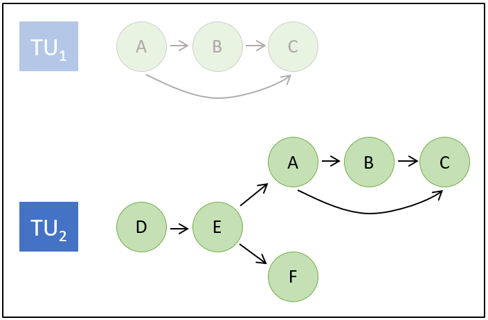
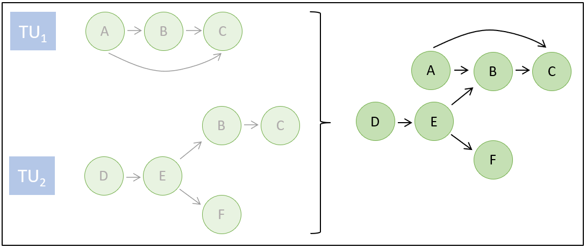
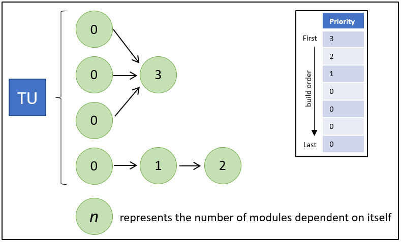
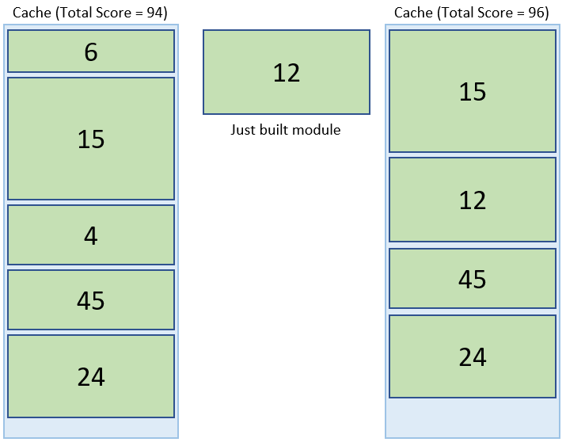

## Project Description

The project will be split into three main phases.
1. Integrate build daemon flag into clang driver
2. Setup build daemon
3. Shift work to build daemon
---

**PHASE 1: integrate build daemon flag into the clang driver.**

The clang driver consists of five stages: Parse, Pipeline, Bind, Translate, and Execute. Phase 1 focuses on ensuring that the build daemon flag is properly handled throughout all five stages.

> 1. Parse: Option Parsing

The clang driver will parse `--build-daemon`
```console
$ clang++ -### --build-daemon foo.cpp bar.cpp -o target

"clang-17" "-cc1" ... "--build-daemon" "-o" "/tmp/foo-66a77d.o" "-x" "c++" "foo.cpp"
"clang-17" "-cc1" ... "--build-daemon" "-o" "/tmp/bar-73584c.o" "-x" "c++" "bar.cpp"
"ld" ... "-o" "target" ... "/tmp/foo-66a77d.o" "/tmp/bar-73584c.o" ...
```

NOTE: The user should be able to include a path to precompiled modules which can be used by the build daemon. For this to function correctly pre compiled modules must contain context hash.

THOGUHT: I am not sure any other phase of the driver needs to be touched. I want to prioritize encapsalation but adding another phase `daemon` to the pipeline portion of the driver may be pointless. I need to do more research on the utility of creating an additional phase rather then including new work in a preexisting phase. Incase I need to add the phase `deamon` I included a small section on it in my draft proposal.

> 2. Pipeline: Compilation Action

To improve encapsulation functionality encompased by the build deamon will be treated as its own subprocess and be included in the tree of phases. As input the `deamon` phase will use a preprocessed translation unit and output all built modules necessary to build the translation unit.

``` console
$ clang++ -ccc-print-phases --build-daemon foo.cpp

               +- 0: input, "foo.cpp", c++
            +- 1: preprocessor, {0}, c++-cpp-output
         +- 2: deamon, {1}, pcm
      +- 3: compiler, {2}, ir
   +- 4: backend, {3}, assembler
+- 5: assembler, {4}, object
6: linker, {5}, image
```

> 3. Bind: Tool & Filename Selection

The ToolChain will select `clang` as the appropriate tool to handle phase 2: deamon.

``` console
$ clang++ -ccc-print-bindings --build-daemon foo.cpp -o target

# "x86_64-unknown-linux-gnu" - "clang", inputs: ["foo.cpp"], output: "/tmp/foo-f45458.o"
# "x86_64-unknown-linux-gnu" - "GNU::Linker", inputs: ["/tmp/foo-f45458.o"], output: "target"
```

> 4. Translate: Tool Specific Argument Translation
> 5. Execute

When `--build-deamon` is passed to the clang driver Translate must include the `--build-deamon` flag with each invocation of clang.

---
**PHASE 2: Setup build daemon infrastructure**

The goal of phase 2 is to implement the boiler plate and infrastructure required to develop the build daemon's core functionality. This includes an outline of the build deamon, anything requiried to spawn the deamon with `--deamon-build`, ability for clang invocations to register with the deamon, and a mechanism to terminate the deamon.

There is an existing daemon implementation in a downstream fork (https://github.com/apple/llvm-project/blob/next/clang/tools/driver/cc1depscan_main.cpp) that can be used to speed up phase 2 develoment.

> Initialization

When `--build-daemon` is passed to the clang driver it will be fowarded along to each clang invocation. The clang invocation will preprocess a translation unit then look for the running process: `clang-build-daemon`. If `clang-build-daemon` exists the clang invocation will register with the daemon. If `clang-build-daemon` does not exist the clang invocation will first initialize `clang-build-daemon` then register with the running process.

```cpp
if (clang-build-daemon == running) {
	register(translationUnit);
} else {
	startDeamon();
	register(translationUnit);
}
```

> Termination

The build deamon will automatically terminate after "sitting empty" for a specified amount of time. For example, if a clang invocations de-registers with the deamon leaving it with zero registered clang invocations. The deamon will wait `n` seconds before terminating itself. By using a time limit the deamon will not be tied to a single target and may persist across a large project. 

THOUGHT: The downside to terminating after a specified amount of time is that there will be `n` seconds of pointless resource usage. I am particularly interested in hearing the communities thoughts on the best way to terminate the build deamon. It feels like there has to be a better way.

---
**PHASE 3: Build System**

The goal of phase 3 is to implement the core functionality of the build deamon such as scanning, scheduling, cache management, and module building. Phase 3 is the largest phase by far. 

> Scanning

The deamon will utilize the tool `clang-scan-deps` to conduct dependency scans for each translation unit registered with the deamon. Once scanned, each translation unit's dependency graph, will be merged when possible to create a project wide dependency graph. While modules may not survive the lifetime of the deamon the dependency graph will and can be used to efficiently schedule builds.

Bellow are two example of scanning. In the first example TU1's dependency graph is a subset of TU2's dependency graph. The deamon, after scanning TU2 would realize that the dependency graph of TU1 is fully encompased by TU2's dependency graph and would free it from memory. In example two, after scanning TU2's dependency graph the deamon would merge the two dependency graphs.<br>

<br>


> Scheduling & Building

Builds will be based on priority list based scheduling. Each module will be ranked based on how many other modules are dependent on itself and built acordingly.



> Cache management

When a module is built the deamon will check how much space is left in the cache. If the size of the built module is less then the amount of cache available the module will be committed to cache. If the size of the built module is greater then the amount of cache available then the deamon will perform cache invalidation. During cache invalidation either the just build module will be discarded or cache will be made available by discarding other prebuilt modules.

The cache invalidator will consider several different metrics when deciding how to make space.

- How "hot" is the module?
	- How may times has the module been required throughout the lifetime of the build?
	- How long has it been since the module was last required?
- How large is the module?

The goal of the build deamon is to minimize build time. Finding the right equation will take some experimentation but the basic idea is to assign a score to each prebuilt module including the one just built and maximize the total score of the cache. For example, `score = number_of_times_built - time_since_last_build` could be used to prioritize modules. In the image bellow the deamon has completed building a module and places it in the cache by removing two other modules increasing the cache score by two.



THOUGHT: I am not sure if cache should be RAM or disk. RAM would obviously be faster but disk could hold more modules. I think a combination of the two is probably the right answer but that implementaition may be out of scope for GSoC. 


