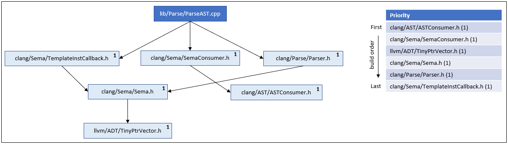

## Motivation

One of the great promises of modules is compile time improvements. Textual inclusion builds are slow. A header file must be re-processed every time a translation unit includes it. With modules, each module is processed only once and re-used by all translation units that import it. Modules provide an opportunity to optimize the build of dependencies rather than blindly processing every dependency mentioned in each translation unit. Currently, clang provides two ways to build modules: implicitly and explicitly. Both methods have strengths and weaknesses. Explicit modules are fast but require significant development effort on the part of build systems while implicit modules are relatively inefficient but can integrate into existing workflows seamlessly. "Modules build daemon: build system agnostic support for explicitly built modules" is an effort to find a compromise between implicit and explicit modules so that developers can enjoy the benefits of explicit modules regardless of build system.

## Overview

A daemon that can serve as a build system designed to manage modules will be implemented to provide build systems agnostic support for explicitly built modules. With the simple addition of a single command line flag, each clang invocation will register its translation unit with the daemon. The daemon will take the registered translation unit and scan its dependencies. As translation units are registered and scanned, the daemon will create a dependency graph for the project. In parallel, the daemon can leverage the emerging graph to schedule and build each module's AST. Before processing each module, the daemon will check to ensure the dependency has not already been processed or is being processed. The goal is to have a single entity, with knowledge of the entire build process, that can efficiently coordinate and manage the build of dependencies (i.e., modules).

## Core Tenants

- The build daemon must be fast to minimize overhead
    - Without providing a performance boost relative to the implicit system this project provides minimal benefits to the community in return for a large amount of work.
- The build daemon must be highly encapsulated
    - One problematic aspect of the implicit system is that the compiler has begun to look like a build system. A goal of this project is to encapsulate all build system like functionality into the daemon so that the rest of clang can focus on being a compiler.
- The build daemon must be accessible with a single flag

## Scope

Work will focus on parallel Unix builds using traditional Clang modules and C++ standard modules.

---
## Project Details

The project will be split into three main phases
1. Integrate build daemon flag into clang driver
2. Setup build daemon infrastructure
3. Implement core build daemon functionality

**PHASE 1: integrate build daemon flag into the clang driver.**

The clang driver consists of five stages: Parse, Pipeline, Bind, Translate, and Execute. Phase 1 focuses on ensuring that the build daemon flag is properly handled throughout all five stages. The bulk of how the daemon flag is handled is based on the downstream scanning daemon.

> 1. Parse: Option Parsing

The clang driver will parse `--module-build-daemon`

```console
$ clang++ --module-build-daemon foo.cpp bar.cpp -o test
```

NOTE: The user should also be able to include a path to precompiled modules which can be used by the build daemon. For this to function correctly pre compiled modules must contain their context hash.

> 2. Pipeline: Compilation Action

There will be no change to the pipeline stage. The module build deamon fits in well with `2: compiler` as it contributes to the ir that will be handed the backend. The daemon will provide each clang invocation with the IR ASTs for each module required.

``` console
$ clang++ -ccc-print-phases --module-build-daemon foo.cpp

            +- 0: input, "foo.cpp", c++
         +- 1: preprocessor, {0}, c++-cpp-output
      +- 2: compiler, {1}, ir
   +- 3: backend, {2}, assembler
+- 4: assembler, {3}, object
5: linker, {4}, image
```

> 3. Bind: Tool & Filename Selection

The `ToolChain` will still select `clang` as the appropriate tool.

``` console
$ clang++ -ccc-print-bindings --module-build-daemon foo.cpp -o test

# "x86_64-unknown-linux-gnu" - "clang", inputs: ["foo.cpp"], output: "/tmp/foo-f45458.o"
# "x86_64-unknown-linux-gnu" - "GNU::Linker", inputs: ["/tmp/foo-f45458.o"], output: "test"
```

> 4. Translate: Tool Specific Argument Translation

When `--module-build-deamon` is passed to the clang driver Translate must include `-cc1modbuildd` as the first flag with each clang invocation. By treating `-cc1modbuildd` as an alternative to `-cc1` the module build deamon will be highly encapsulated.

```console
$ clang++ -### --module-build-daemon foo.cpp bar.cpp -o test

"clang-17" "-cc1modbuildd" "-o" "/tmp/foo-66a77d.o" "-x" "c++" "foo.cpp"
"clang-17" "-cc1modbuildd" "-o" "/tmp/bar-73584c.o" "-x" "c++" "bar.cpp"
"ld" ... "-o" "test" ... "/tmp/foo-66a77d.o" "/tmp/bar-73584c.o" ...
```

> 5. Execute

Compilation is executed.

---
**PHASE 2: Setup build daemon infrastructure**

The goal of phase 2 is to implement the boiler plate and infrastructure required to develop the build daemon's core functionality. This includes the ability to spawn the deamon with `-cc1modbuildd`, ability for clang invocations to register with the deamon, and a mechanism to terminate the deamon.

There is an existing daemon implementation that can scan file dependencies in a downstream fork (https://github.com/apple/llvm-project/blob/next/clang/tools/driver/cc1depscan_main.cpp) that will be used to help phase 2 develoment.

THOUGHT: To prevent duplicate code between `cc1depscand` and `cc1modbuildd` I think it would be a good idea to move common deamon functionality out of `cc1depscan*` files to another location. Perhaps a llvm-project/clang/tools/daemon directory could be created.

> Daemon Details
- The IPC mechanism used to comunicate with the daemon will be unix sockets
	- NOTE: Windows is in the process of supporting unix sockets 
		- (https://devblogs.microsoft.com/commandline/af_unix-comes-to-windows/)

> Initialization

When `--module-build-daemon` is passed to the clang driver `-cc1modbuildd` will be included as the first flag of each clang invocation. The clang invocation will preprocess a translation unit then look for a running daemon. If the daemon exists the clang invocation will register with it. If the daemon does not exist the clang invocation will first initialize the deamon then register with it.

```cpp
// driver.cpp

int clang_main() {
	if (Args.size() >= 2 && StringRef(Args[1]).startswith("-cc1"))
		return ExecuteCC1Tool();
}

static int ExecuteCC1Tool() {
	if (Tool == "-cc1modbuildd")
		return cc1modbuildd_main();
}
```

```cpp
// cc1modbuildd_main.cpp

int cc1modbuildd_main() {

	bool NoSpawnDaemon = (bool)Sharing.Path;
	auto Daemon = NoSpawnDaemon
                    ? Daemon::connectToDaemonAndShakeHands(Path)
                    : Daemon::constructAndShakeHands(Path, Exec, Sharing);

	// register with daemon
	CC1DaemonProtocol Comms(*Daemon);
	Comms.putCommand(WorkingDirectory, OldArgs, Mapping);
}
```

> Termination

The build deamon will automatically terminate after "sitting empty" for a specified amount of time. For example, if a clang invocations de-registers with the daemon leaving it with zero registered clang invocations. The deamon will wait `n` seconds before terminating itself. By using a time limit the deamon will not be tied to a single executable and may persist across a large project. 

---
**PHASE 3: Implement core build daemon functionality**

The goal of phase 3 is to implement as scanning, scheduling, cache management, and module building. Phase 3 is the largest phase by far. 

> Scanning

While `cc1depscan_main.cpp` implements a scanning daemon it is limited to file dependencies. So, the build deamon will base it's scanning on the tool `clang-scan-deps`. `clang-scan-deps` can be integrated into the build daemon by relying on `class FullDeps`.

`FullDeps` or more specifically the `FullDeps` attribute `Modules` will represet all dependencies for the daemon. The scans for each translation unit will be merged into `Modules` using the public method `void mergeDeps(StringRef Input, TranslationUnitDeps TUDeps, size_t InputIndex)`.

```cpp
// ClangScanDeps.cpp

class FullDeps
	public:
		void mergeDeps(StringRef Input, TranslationUnitDeps TUDeps, size_t InputIndex);
	private:
		std::unordered_map<IndexedModuleID, ModuleDeps, IndexedModuleIDHasher> Modules;

struct ModuleDeps
{
	ModuleID ID; // module ID
	llvm::StringSet<> FileDeps; // collection of paths to direct dependencies
}
```

NOTE: This requires moving `class FullDeps` to its own file.

> Scheduling & Building

Scheduling will be done in accoradance with a deterministic topological sort. The order of dependencies will be based first on the number of translation units that require a dependency then second on the alphabetical ordering of the dependencies. 

For example, the build daemon receives its first registration, `lib/Parse/ParseAST.cpp`, and creates a graph of its dependencies. At first, since `lib/Parse/ParseASTcpp` is the only translation unit regestered with the build daemon the dependencies all have the same weight of `1` and are ordered in alphabetical order.



Now, a second translation unit, `lib/Sema/SemaConcept.cpp`, is registered with the build daemon. The build daemon scans it's dependencies and incorporates the new translation unit's dependency graph into the projects dependency graph. 


The weights and priority are updated to reflect the new information.


> Cache Management

The cache will comprise precompiled modules in the form of Clang AST files. Clang AST files contain a compressed bitstream of the AST and supporting data structures and can be chained to represent a project's dependency graph, making them a good fit for the build daemon.

The precompiled modules will initially solely be stored on disk allowing all precompiled modules to be stored simultaneously on the majority of modern computers.[1] To accommodate resource constrained systems a simple cache invalidator will be implemented. 

The cache invalidator will combine frequency based prioritization, time-to-live prioritization, and the dependency graph to determine which modules are saved. Everytime a module is built or used a new time-to-live will be calculated based on the following equations. 

```cpp
// senario one: module is compiled and added to cache
initial_ttl = depth_in_DAG * SCALING_FACTOR_1;

// senario two: precompiled module is used
new_ttl = curent_ttl + (depth_in_DAG * SCALING_FACTOR_2);
```

[1] future development work could include creating an in memory cache in addition to an on disk cache

---
## Timeline

Review of official timeline
- March 20 to April 4: GSoC application period
- May 4: Accepted projects announced
- May 29 to August 28 (13 weeks): Work!

Project Timeline & Milestones

- Phase 0: Present to May 28
	1. Iron out implementation and design details
- Phase 1: May 29 - June 11 (2 weeks)
    1. Add `--module-build-daemon` flag to clang so that it is recognized as a valid flag
	2. Make sure clang driver properly handles `--module-build-daemon` flag
- Phase 2: June 12 - July 2 (3 weeks)
	1. Create skeleton build daemon that can be initialized with `-cc1modbuildd` and shut down
	2. Implimint ability for clang instances to register and unregister with the deamon. Daemon should maintain a running list of clang invocations registered. 
- Phase 3: July 3 - August 28 (8 weeks)
    1. Implement ability for daemon to scan dependencies of registered clang instances using clang-scan-deps. Results will be saved to a log file on a per invocation basis. This is to make sure that scanning can be done correctly
	3. Implement scheduling strategy. No modules will actually be built but rather simulated. Log file will output current version of dependency graph and associated build schedule
	4. Implement ability for daemon to spawn clang invocations to build modules. For the sake of simplicity at this point all built modules will be stored on disk for the lifetime of the build
	5. Implement cache management strategy

---
## Future Work

I am excited about the project and will not be able to accomplish everything I would like to in the alloted time period. I have listed a few enhancements I look foward to tackling after GSoC.

- Implement support for other operating systems (i.e. windows)
- Implement support for serial and distributed builds
- Add flags to customize deamon behavior
    - Time before termination
	- Cache size
- Profiling
- Schedule and cache optimization
	- Add a "hot" cache that stores precompiled modules in memory


